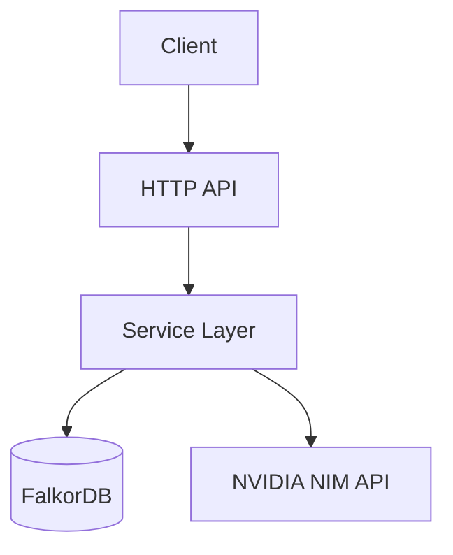

# data-vent Architecture

## Overview
This document describes the high-level architecture of `data-vent`.

## System Design

## Key Components
- **HTTP API Layer**: Handles incoming HTTP requests and SSE streams.
- **Service Layer**: Core business logic for intelligent retrieval.
- **Data Access**: Manages FalkorDB vector and graph queries.
