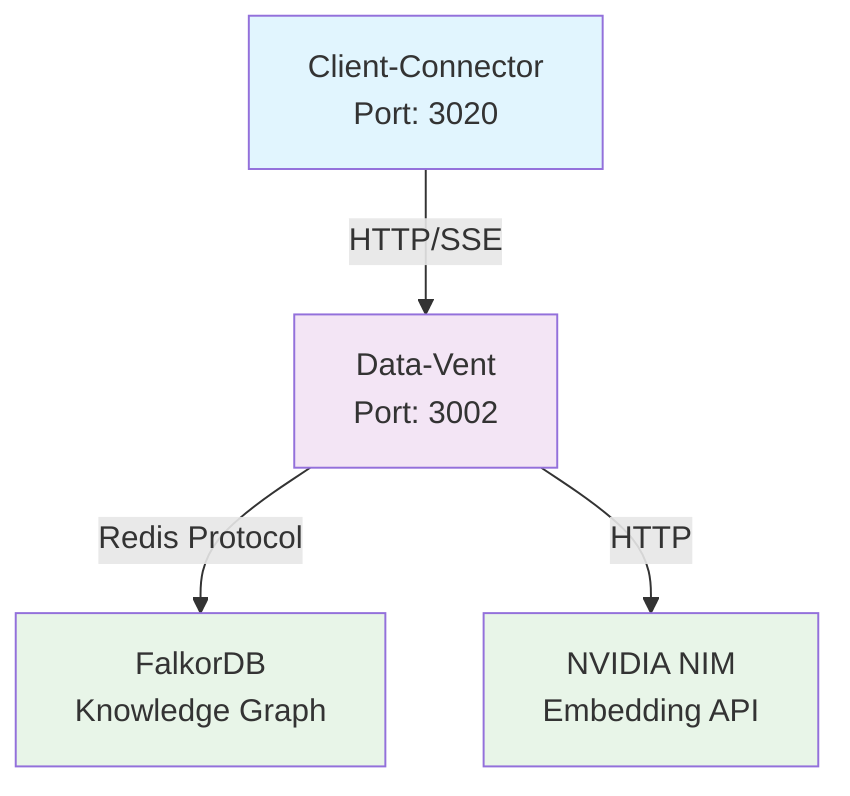

# data-vent

> **Intelligent Retrieval Service**

## What is this service?

The **data-vent** is ConFuse's intelligent retrieval engine that provides semantic search and graph traversal capabilities. It serves as the knowledge retrieval layer for the ConFuse platform, handling hybrid vector+graph searches for AI agents and applications.

## Quick Start

```bash
# Build and run
cargo build
cargo run
```

The service starts at:
- **HTTP**: `http://localhost:3002`

## Documentation

|| Document | Description |
|----------|-------------|
| [Architecture](architecture.md) | Service design and data flow |
| [API Reference](api-reference.md) | HTTP API endpoints |

## How It Fits in ConFuse



## Key Features

### 1. **Intelligent Retrieval**
- **Query Decomposition**: Breaks complex queries into search chunks
- **Parallel Search**: Concurrent vector and graph searches
- **Result Aggregation**: Merges and ranks results from multiple sources
- **Hybrid Scoring**: Combines vector similarity with graph relationships

### 2. **Vector Search**
- **Semantic Similarity**: Embedding-based search via NVIDIA NIM
- **FalkorDB Integration**: Native vector search capabilities
- **Threshold Filtering**: Configurable similarity thresholds
- **Top-K Results**: Configurable result limits

### 3. **Graph Traversal**
- **DFS Algorithm**: Depth-first search through knowledge graph
- **Relationship Following**: Navigates graph relationships
- **Relevance Scoring**: Relevance-based result filtering
- **Cross-Chunk Boosting**: Enhanced results from related chunks

## Technology Stack

|| Technology | Purpose | Version |
||------------|---------|---------|
|| **Rust** | Runtime | 2021 |
|| **Axum** | Web Framework | 0.7.5 |
|| **Tokio** | Async Runtime | 1.37.0 |
|| **FalkorDB** | Knowledge Graph | Latest |
|| **NVIDIA NIM** | Embedding API | Latest |
|| **Redis** | Database Client | 0.25.3 |

## API Endpoints

### HTTP API (Port 3002)

#### Retrieval Operations
```http
# Standard retrieval
POST /api/v1/retrieve
{
  "intent": "How does authentication work?",
  "keywords": ["auth", "token", "jwt"],
  "limit": 10,
  "falkordb_graph_name": "graph-user123"
}

# Streaming retrieval
POST /api/v1/retrieve/stream
{
  "intent": "React component patterns",
  "keywords": ["hooks", "state", "effects"],
  "limit": 20
}
```

#### Health Check
```http
GET /health
```

## Environment Configuration

### Required Environment Variables

#### `.env.map` (Non-sensitive)
```bash
# Service Configuration
DATA_VENT_PORT=3002
HOST=0.0.0.0

# FalkorDB Configuration
FALKORDB_HOST=localhost
FALKORDB_PORT=6379
FALKORDB_USERNAME=default
FALKORDB_GRAPH_NAME=confuse_graph
FALKORDB_VECTOR_DIMENSION=768
FALKORDB_SIMILARITY_THRESHOLD=0.7
FALKORDB_MAX_RESULTS=10
FALKORDB_USE_TLS=false

# NVIDIA NIM Configuration
NVIDIA_NIM_BASE_URL=https://integrate.api.nvidia.com
DEFAULT_EMBEDDING_MODEL=nv-embed-v1

# Retrieval Pipeline
PIPELINE_MAX_QUERY_CHUNKS=5
PIPELINE_PER_CHUNK_TIMEOUT=5.0
PIPELINE_VECTOR_TOP_K=10
PIPELINE_DFS_DEPTH=2
PIPELINE_DFS_MIN_RELEVANCE=0.5
PIPELINE_DFS_MAX_RESULTS=20
PIPELINE_MAX_TOTAL_RESULTS=50
PIPELINE_VECTOR_WEIGHT=0.7
PIPELINE_GRAPH_WEIGHT=0.3
PIPELINE_CROSS_CHUNK_WEIGHT=0.1

# Logging
LOG_LEVEL=INFO
```

#### `.env.secret` (Sensitive)
```bash
# FalkorDB Authentication
FALKORDB_PASSWORD=your_falkordb_password

# NVIDIA NIM API Key
NVIDIA_NIM_API_KEY=your_nvidia_api_key
```

## Performance Optimization

### Caching Strategy
- **Query Results**: Cache frequent search results
- **Embeddings**: Cache query embeddings
- **Graph Metadata**: Cache graph structure information

### Parallel Processing
- **Concurrent Searches**: Parallel vector and graph searches
- **Batch Processing**: Efficient result aggregation
- **Async I/O**: Non-blocking database operations

## Monitoring & Observability

### Health Monitoring
```bash
# Service health
GET /health

# Response
{
  "status": "healthy",
  "service": "data-vent",
  "version": "0.2.0",
  "pipeline": "active"
}
```

## Development

### Local Development Setup
```bash
# Build the project
cargo build

# Run the service
cargo run

# Run with environment
DATA_VENT_PORT=3002 cargo run
```

## Troubleshooting

### Common Issues

#### "FalkorDB connection failed"
- Verify FalkorDB host and port configuration
- Check network connectivity
- Verify authentication credentials

#### "NVIDIA NIM API timeout"
- Check API key configuration
- Verify network connectivity to NVIDIA NIM
- Increase timeout configuration

#### "No results returned"
- Verify graph name configuration
- Check similarity threshold settings
- Ensure graph has indexed data

## License

Proprietary - ConFuse Team
