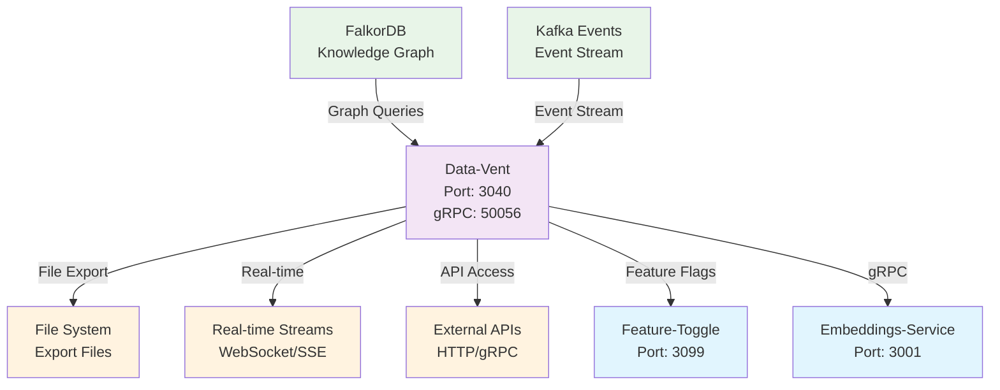
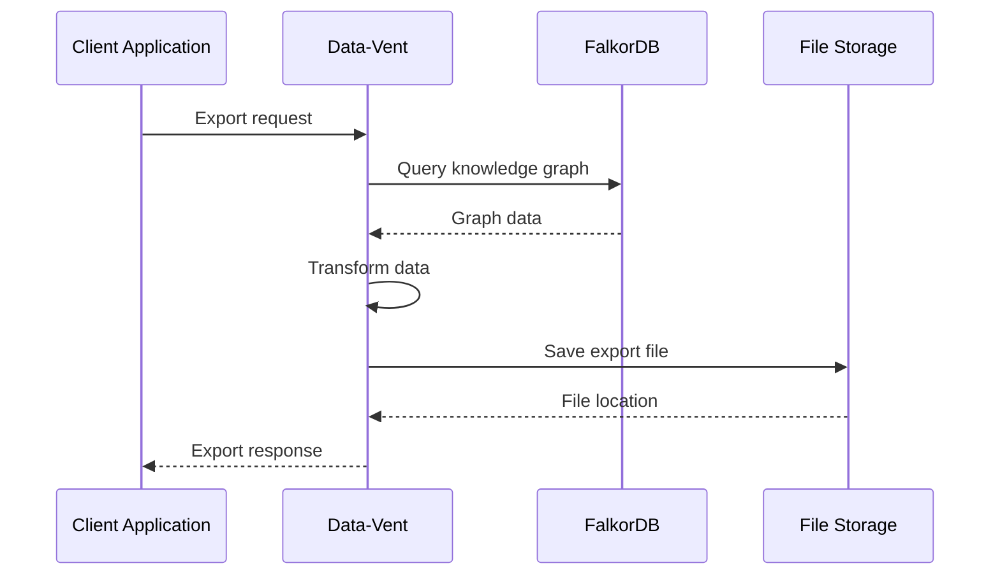
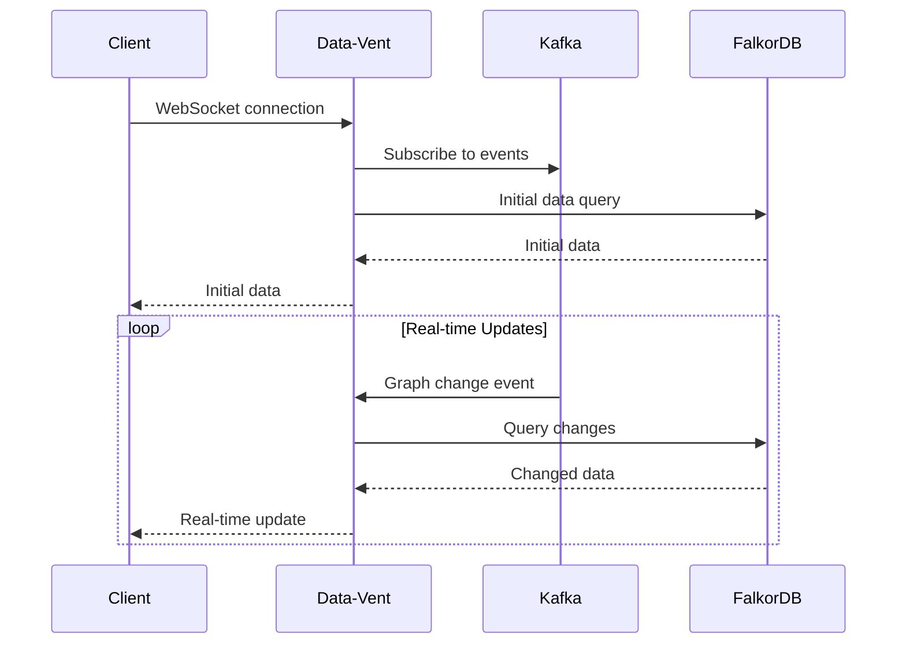

# ConFuse Data Vent

> **Data Streaming and Export Service**

## What is this service?

The **data-vent** is ConFuse's data streaming and export service that provides real-time access to the knowledge graph and enables data export in multiple formats. It serves as the data egress layer for the ConFuse platform.

## Quick Start

```bash
# Clone and install
git clone https://github.com/confuse/data-vent.git
cd data-vent

# Setup Python environment
python -m venv .venv
source .venv/bin/activate  # Linux/Mac
# or .venv\Scripts\activate  # Windows

# Install dependencies
pip install -r requirements.txt

# Configure environment
cp .env.map.example .env.map
cp .env.secret.example .env.secret

# Start the service
uvicorn app.main:app --host 0.0.0.0 --port 3040
```

The service starts at:
- **HTTP**: `http://localhost:3040`
- **gRPC**: `localhost:50056`

## Documentation

| Document | Description |
|----------|-------------|
| [Architecture](architecture.md) | Service design and data flow |
| [API Reference](api-reference.md) | Complete REST/gRPC endpoints |
| [Configuration](configuration.md) | Environment variables |
| [Export Formats](export-formats.md) | Supported export formats |
| [Streaming](streaming.md) | Real-time streaming capabilities |

## How It Fits in ConFuse



## Key Features

### 1. **Real-Time Data Streaming**
- **WebSocket Streams**: Live data streaming to clients
- **Server-Sent Events**: HTTP-based streaming for web clients
- **Kafka Integration**: Event stream consumption and distribution
- **Change Data Capture**: Real-time graph change notifications

### 2. **Multi-Format Export**
- **Structured Data**: JSON, CSV, Parquet export formats
- **Graph Data**: GraphML, GEXF, Cypher export formats
- **Documents**: PDF, Markdown, HTML export formats
- **Custom Formats**: Extensible format transformation system

### 3. **Knowledge Graph Access**
- **Query Interface**: Flexible graph querying capabilities
- **Vector Search**: Semantic similarity search exports
- **Entity Extraction**: Structured entity and relationship export
- **Temporal Data**: Time-series and historical data access

### 4. **High-Performance Processing**
- **Batch Processing**: Efficient bulk data export
- **Streaming Processing**: Real-time data transformation
- **Caching**: Intelligent result caching
- **Parallel Processing**: Multi-threaded data processing

## Technology Stack

| Technology | Purpose | Version |
|------------|---------|---------|
| **Python** | Runtime | >=3.14 |
| **FastAPI** | Web Framework | >=0.109.0 |
| **FalkorDB** | Knowledge Graph | Latest |
| **Kafka** | Event Streaming | Latest |
| **WebSockets** | Real-time Communication | Latest |
| **Pandas** | Data Processing | >=2.0.0 |
| **PyArrow** | Columnar Data | >=15.0.0 |

## Data Flow Architecture

### Export Pipeline


### Streaming Pipeline


## API Endpoints

### REST API (Port 3040)

#### Export Operations
```http
# Export graph data
POST /api/v1/export/graph
{
  "format": "json",
  "query": "MATCH (n:Entity) RETURN n",
  "filters": {
    "node_types": ["Entity", "Document"],
    "date_range": {
      "start": "2026-01-01",
      "end": "2026-12-31"
    }
  }
}

# Export entities
POST /api/v1/export/entities
{
  "format": "csv",
  "entity_types": ["CodeFile", "Document"],
  "include_relationships": true
}

# Export search results
POST /api/v1/export/search
{
  "query": "React hooks patterns",
  "format": "json",
  "limit": 1000,
  "include_embeddings": false
}
```

#### Streaming Endpoints
```http
# WebSocket streaming
WS /api/v1/stream/graph

# Server-Sent Events
GET /api/v1/stream/events
Accept: text/event-stream

# Real-time search
GET /api/v1/stream/search?q=react&format=json
```

#### Query Operations
```http
# Graph query
POST /api/v1/query/graph
{
  "cypher": "MATCH (n:CodeFile)-[:CONTAINS]->(f:Function) RETURN n, f",
  "parameters": {}
}

# Vector search
POST /api/v1/search/vector
{
  "query": "React component patterns",
  "threshold": 0.75,
  "limit": 50
}

# Entity lookup
GET /api/v1/entities/{entity_id}
```

### gRPC Service (Port 50056)

#### Export Operations
```protobuf
service DataVent {
  rpc ExportGraph(ExportGraphRequest) returns (ExportResponse);
  rpc ExportEntities(ExportEntitiesRequest) returns (ExportResponse);
  rpc StreamGraph(StreamGraphRequest) returns (stream GraphData);
  rpc StreamEvents(StreamEventsRequest) returns (stream EventData);
  
  rpc QueryGraph(QueryGraphRequest) returns (QueryResponse);
  rpc VectorSearch(VectorSearchRequest) returns (SearchResponse);
  rpc GetEntity(GetEntityRequest) returns (EntityResponse);
}
```

## Environment Configuration

### Required Environment Variables

#### `.env.map` (Non-sensitive)
```bash
# Service Configuration
PORT=3040
GRPC_PORT=50056
HOST=0.0.0.0
ENVIRONMENT=production

# FalkorDB Configuration
FALKORDB_HOST=localhost
FALKORDB_PORT=6379
FALKORDB_GRAPH_NAME=confuse_knowledge

# Search Configuration
FALKORDB_VECTOR_DIMENSION=384
FALKORDB_SIMILARITY_THRESHOLD=0.75
FALKORDB_MAX_RESULTS=100

# Service URLs
FEATURE_TOGGLE_SERVICE_URL=http://localhost:3099

# Export Configuration
EXPORT_DIR=/exports
MAX_EXPORT_SIZE_MB=1000
EXPORT_TIMEOUT_SECONDS=300

# Streaming Configuration
STREAM_BUFFER_SIZE=1000
WEBSOCKET_PING_INTERVAL=30
SSE_HEARTBEAT_INTERVAL=15
```

#### `.env.secret` (Sensitive)
```bash
# FalkorDB Authentication
FALKORDB_USERNAME=your_falkordb_username
FALKORDB_PASSWORD=your_falkordb_password

# Kafka Configuration
KAFKA_USERNAME=your_kafka_username
KAFKA_PASSWORD=your_kafka_password

# External API Keys
EXTERNAL_API_KEY=your_external_api_key
```

## Export Formats

### Structured Data Formats

#### JSON Export
```json
{
  "format": "json",
  "structure": "nested",
  "include_metadata": true,
  "pretty_print": true
}
```

#### CSV Export
```json
{
  "format": "csv",
  "delimiter": ",",
  "include_headers": true,
  "flatten_nested": true
}
```

#### Parquet Export
```json
{
  "format": "parquet",
  "compression": "snappy",
  "partition_by": ["entity_type", "date"]
}
```

### Graph Data Formats

#### GraphML Export
```json
{
  "format": "graphml",
  "include_attributes": true,
  "node_types": ["Entity", "Document"],
  "relationship_types": ["CONTAINS", "REFERENCES"]
}
```

#### GEXF Export
```json
{
  "format": "gexf",
  "include_visualization": false,
  "edge_weights": true
}
```

#### Cypher Export
```json
{
  "format": "cypher",
  "include_indexes": true,
  "include_constraints": true
}
```

## Streaming Capabilities

### WebSocket Streaming
```javascript
// Connect to graph stream
const ws = new WebSocket('ws://localhost:3040/api/v1/stream/graph');

ws.onmessage = (event) => {
  const data = JSON.parse(event.data);
  console.log('Graph update:', data);
};

// Subscribe to specific entity types
ws.send(JSON.stringify({
  action: 'subscribe',
  filters: {
    entity_types: ['CodeFile', 'Document'],
    event_types: ['created', 'updated', 'deleted']
  }
}));
```

### Server-Sent Events
```javascript
// SSE connection for events
const eventSource = new EventSource('/api/v1/stream/events');

eventSource.onmessage = (event) => {
  const data = JSON.parse(event.data);
  console.log('Event:', data);
};

eventSource.addEventListener('graph-change', (event) => {
  const change = JSON.parse(event.data);
  console.log('Graph change:', change);
});
```

### Kafka Integration
```python
# Kafka consumer for data events
from kafka import KafkaConsumer

consumer = KafkaConsumer(
    'graph-changes',
    'entity-updates',
    bootstrap_servers=['localhost:9092'],
    value_deserializer=lambda x: json.loads(x.decode('utf-8'))
)

for message in consumer:
    event = message.value
    print(f"Received event: {event['type']}")
    print(f"Entity: {event['entity_id']}")
    print(f"Data: {event['data']}")
```

## Query Interface

### Graph Queries (Cypher)
```cypher
-- Find all code files in a repository
MATCH (repo:Repository {name: 'my-repo'})-[:CONTAINS]->(file:CodeFile)
RETURN file.path, file.language, file.size

-- Find related entities
MATCH (entity:Entity {id: 'entity-123'})-[:RELATED_TO]-(related:Entity)
RETURN related.id, related.type, related.properties

-- Semantic search with vector similarity
CALL db.query.vector.search('Vector_Chunk', $embedding, {limit: 10})
YIELD node, score
RETURN node.content, node.metadata, score
```

### Vector Search
```json
{
  "query": "React hooks usage patterns",
  "filters": {
    "entity_types": ["CodeFile"],
    "languages": ["javascript", "typescript"],
    "date_range": {
      "start": "2026-01-01",
      "end": "2026-12-31"
    }
  },
  "threshold": 0.75,
  "limit": 50,
  "include_metadata": true
}
```

### Entity Queries
```json
{
  "entity_id": "entity-123",
  "include_relationships": true,
  "include_embeddings": false,
  "depth": 2
}
```

## Performance Optimization

### Caching Strategy
- **Query Results**: Cache frequently used query results
- **Export Files**: Cache generated export files
- **Graph Metadata**: Cache graph schema and statistics
- **Vector Indexes**: Cache vector search results

### Batch Processing
- **Bulk Exports**: Efficient processing of large datasets
- **Parallel Queries**: Concurrent query execution
- **Stream Processing**: Efficient data transformation
- **Memory Management**: Optimized memory usage for large datasets

### Rate Limiting
- **API Limits**: Prevent abuse of export endpoints
- **Stream Limits**: Control streaming connection rates
- **Query Limits**: Prevent expensive graph queries
- **Export Limits**: Control export file sizes

## Monitoring & Observability

### Metrics Collection
- **Export Metrics**: Export volume, formats, and performance
- **Streaming Metrics**: Active connections, data rates
- **Query Metrics**: Query performance and success rates
- **Resource Metrics**: Memory, CPU, and storage usage

### Logging Strategy
- **Structured Logging**: JSON format with correlation IDs
- **Request Logging**: All API requests and responses
- **Error Logging**: Detailed error information and stack traces
- **Performance Logging**: Query timing and export duration

### Health Monitoring
```bash
# Service health
GET /health

# Detailed status
GET /status

# Export status
GET /exports/{export_id}/status

# Streaming metrics
GET /metrics/streaming
```

## Security Model

### Access Control
- **Authentication**: JWT token validation
- **Authorization**: Role-based access control
- **Data Filtering**: Row-level security for sensitive data
- **Audit Logging**: Complete audit trail of data access

### Data Protection
- **Encryption**: TLS 1.3 for all communications
- **Data Masking**: Sensitive data masking in exports
- **Access Logs**: Comprehensive access logging
- **Retention Policies**: Configurable data retention

## Development

### Local Development Setup
```bash
# Install development dependencies
pip install -e ".[dev]"

# Run with hot reload
uvicorn app.main:app --reload --host 0.0.0.0 --port 3040

# Run tests
pytest

# Run with coverage
pytest --cov=app tests/
```

### Testing
```bash
# Unit tests
pytest tests/unit/

# Integration tests
pytest tests/integration/

# Export format tests
pytest tests/exports/

# Streaming tests
pytest tests/streaming/
```

### Performance Testing
```bash
# Load testing
pytest tests/performance/ -m "load"

# Export performance
pytest tests/performance/ -m "export"

# Streaming performance
pytest tests/performance/ -m "streaming"
```

## Troubleshooting

### Common Issues

#### "Export timeout"
- Check query complexity and result size
- Verify FalkorDB connection performance
- Increase timeout configuration
- Optimize query with indexes

#### "Streaming connection lost"
- Check WebSocket heartbeat configuration
- Verify network stability
- Monitor client connection handling
- Check buffer size settings

#### "Memory usage high"
- Monitor export file sizes
- Check for memory leaks in streaming
- Optimize batch processing size
- Implement proper cleanup

#### "Query performance slow"
- Check FalkorDB query optimization
- Verify index usage
- Monitor query execution plans
- Consider query result caching

### Debug Mode
```bash
# Enable debug logging
export LOG_LEVEL=DEBUG

# Run with debug output
uvicorn app.main:app --log-level debug

# Test specific export
python -m app.scripts.test_export --format json --query "MATCH (n) RETURN n"
```

## Best Practices

### Export Optimization
- Use appropriate export formats for data size
- Implement incremental exports for large datasets
- Use compression for large export files
- Monitor export performance and optimize queries

### Streaming Best Practices
- Implement proper backpressure handling
- Use connection pooling for WebSocket connections
- Implement graceful degradation for connection loss
- Monitor streaming performance metrics

### Security Practices
- Validate all export requests
- Implement proper access controls
- Monitor for suspicious export activity
- Regularly rotate access credentials

## License

Proprietary - ConFuse Team
